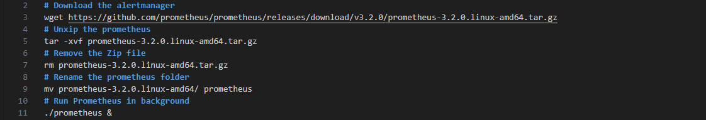
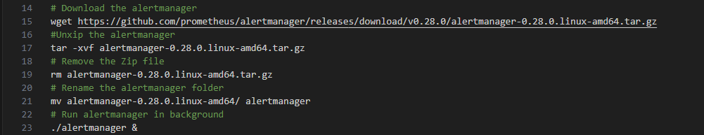
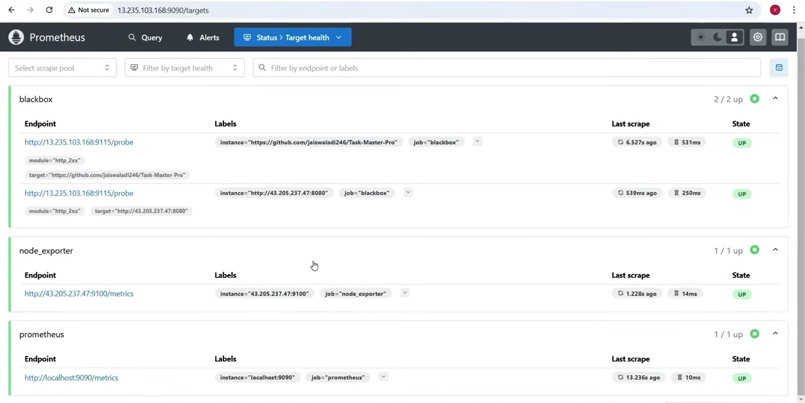

[]{#MonitoringProjectDocumentation.xhtml}

[Monitoring Website and server using Prometsus an Alert Manager]{.c7
.c15}

[]{.c14}

[]{.c14}

[Overview: ]{.c19 .c10} [Implemented a monitoring solution for websites
and servers using Prometheus and Alertmanager, ensuring real-time
observability, proactive incident detection, and automated
alerting.]{.c15 .c10 .c17}

[]{.c14}

[Tech Stack:]{.c3}

[Website: ]{.c19 .c10} [Java(]{.c22 .c10 .c17} [Springboot]{.c22 .c10
.c17} [), HTML, CSS, JavaScript]{.c15 .c10 .c17}

[Monitoring Tools]{.c19 .c10} [: Prometheus, Alertmanager]{.c15 .c10
.c17}

[Infrastructure]{.c10 .c19} [: ]{.c15 .c10 .c17}

-   [AWS Cloud]{.c15 .c10 .c17}

```{=html}
<!-- -->
```
-   [Linux EC2 Instance]{.c15 .c10 .c17}

[]{.c14}

[]{.c14}

[]{.c3}

[]{.c3}

[]{.c3}

[]{.c3}

[]{.c3}

[]{.c3}

[]{.c3}

[]{.c3}

[]{.c3}

[Implementation Steps:]{.c3}

1.  [Setup EC2 Instances:]{.c15 .c10 .c23}

[In this project, two EC2 instances were created---one for Prometheus,
Alertmanager, and Blackbox Exporter, and another for hosting the website
and Node Exporter. The setup process included selecting an appropriate
Amazon Machine Image (AMI) such as Ubuntu, choosing an instance type
based on resource requirements here i have selected ]{.c22 .c10 .c17}
[t2.medium]{.c22 .c17 .c26} [, and configuring security groups to allow
necessary inbound and outbound traffic.]{.c10 .c17 .c22}

[
{style="width: 573.99px; height: 91.58px; margin-left: 0.00px; margin-top: 0.00px; transform: rotate(0.00rad) translateZ(0px); -webkit-transform: rotate(0.00rad) translateZ(0px);"}
]{style="overflow: hidden; display: inline-block; margin: 0.00px 0.00px; border: 0.00px solid #000000; transform: rotate(0.00rad) translateZ(0px); -webkit-transform: rotate(0.00rad) translateZ(0px); width: 573.99px; height: 91.58px;"}

[
{style="width: 564.00px; height: 499.00px; margin-left: 0.00px; margin-top: 0.00px; transform: rotate(0.00rad) translateZ(0px); -webkit-transform: rotate(0.00rad) translateZ(0px);"}
]{style="overflow: hidden; display: inline-block; margin: 0.00px 0.00px; border: 0.00px solid #000000; transform: rotate(0.00rad) translateZ(0px); -webkit-transform: rotate(0.00rad) translateZ(0px); width: 564.00px; height: 499.00px;"}

[]{.c14}

[]{.c14}

2.  [Install and Run Prometheus]{.c3}

[]{.c3}

[Installed Prometheus on Instance 1.]{.c17 .c18}

[Run the following command to download and install Prometheus.]{.c18
.c17}

  [
{style="width: 624.00px; height: 106.67px; margin-left: 0.00px; margin-top: 0.00px; transform: rotate(0.00rad) translateZ(0px); -webkit-transform: rotate(0.00rad) translateZ(0px);"}
]{style="overflow: hidden; display: inline-block; margin: 0.00px 0.00px; border: 0.00px solid #000000; transform: rotate(0.00rad) translateZ(0px); -webkit-transform: rotate(0.00rad) translateZ(0px); width: 624.00px; height: 106.67px;"}

[]{.c18 .c17}

[
{style="width: 624.00px; height: 314.67px; margin-left: 0.00px; margin-top: 0.00px; transform: rotate(0.00rad) translateZ(0px); -webkit-transform: rotate(0.00rad) translateZ(0px);"}
]{style="overflow: hidden; display: inline-block; margin: 0.00px 0.00px; border: 0.00px solid #000000; transform: rotate(0.00rad) translateZ(0px); -webkit-transform: rotate(0.00rad) translateZ(0px); width: 624.00px; height: 314.67px;"}

[]{.c18 .c17}

[]{.c18 .c17}

3.  [Install and Run Alert Manager]{.c3}

[Installed Alert Manager on Instance 1.]{.c18 .c17}

[Run the following command to download and install Alert Manager.]{.c18
.c17}

[
{style="width: 624.00px; height: 120.00px; margin-left: 0.00px; margin-top: 0.00px; transform: rotate(0.00rad) translateZ(0px); -webkit-transform: rotate(0.00rad) translateZ(0px);"}
]{style="overflow: hidden; display: inline-block; margin: 0.00px 0.00px; border: 0.00px solid #000000; transform: rotate(0.00rad) translateZ(0px); -webkit-transform: rotate(0.00rad) translateZ(0px); width: 624.00px; height: 120.00px;"}

[
{style="width: 624.00px; height: 309.33px; margin-left: 0.00px; margin-top: 0.00px; transform: rotate(0.00rad) translateZ(0px); -webkit-transform: rotate(0.00rad) translateZ(0px);"}
]{style="overflow: hidden; display: inline-block; margin: 0.00px 0.00px; border: 0.00px solid #000000; transform: rotate(0.00rad) translateZ(0px); -webkit-transform: rotate(0.00rad) translateZ(0px); width: 624.00px; height: 309.33px;"}

4.  [Install and Run ]{.c12} [Blackbox Exporter]{.c3}

[Installed Blackbox Exporter on Instance 1.]{.c18 .c17}

Run the following command to download and install Blackbox Exporter.

[
{style="width: 624.00px; height: 113.33px; margin-left: 0.00px; margin-top: 0.00px; transform: rotate(0.00rad) translateZ(0px); -webkit-transform: rotate(0.00rad) translateZ(0px);"}
]{style="overflow: hidden; display: inline-block; margin: 0.00px 0.00px; border: 0.00px solid #000000; transform: rotate(0.00rad) translateZ(0px); -webkit-transform: rotate(0.00rad) translateZ(0px); width: 624.00px; height: 113.33px;"}

[
{style="width: 624.00px; height: 309.33px; margin-left: 0.00px; margin-top: 0.00px; transform: rotate(0.00rad) translateZ(0px); -webkit-transform: rotate(0.00rad) translateZ(0px);"}
]{style="overflow: hidden; display: inline-block; margin: 0.00px 0.00px; border: 0.00px solid #000000; transform: rotate(0.00rad) translateZ(0px); -webkit-transform: rotate(0.00rad) translateZ(0px); width: 624.00px; height: 309.33px;"}

[]{.c3}

5.  [Now configure Prometheus, Alert Manager & ]{.c12} [Blackox]{.c12}
    [ exporter]{.c3}

[]{.c3}

[cd prometheus]{.c5}

[vi prometheus.yml]{.c10}

+-----------------------------------------------------------------------+
| [\# my global config]{.c5}                                            |
|                                                                       |
| [global:]{.c5}                                                        |
|                                                                       |
| [  scrape_interval: 15s \# Set the scrape interval to every 15        |
| seconds. Default is every 1 minute.]{.c5}                             |
|                                                                       |
| [  evaluation_interval: 15s \# Evaluate rules every 15 seconds. The   |
| default is every 1 minute.]{.c5}                                      |
|                                                                       |
| [  \# scrape_timeout is set to the global default (10s).]{.c5}        |
|                                                                       |
| []{.c5}                                                               |
|                                                                       |
| [\# Alertmanager configuration]{.c5}                                  |
|                                                                       |
| [alerting:]{.c5}                                                      |
|                                                                       |
| [  ]{.c10} [alertmanagers]{.c10} [:]{.c5}                             |
|                                                                       |
| [    - static_configs:]{.c5}                                          |
|                                                                       |
| [        - targets:]{.c5}                                             |
|                                                                       |
| [          - 65.0.95.7:9093]{.c5}                                     |
|                                                                       |
| []{.c5}                                                               |
|                                                                       |
| [\# Load rules once and periodically evaluate them according to the   |
| global \'evaluation_interval\'.]{.c5}                                 |
|                                                                       |
| [rule_files:]{.c5}                                                    |
|                                                                       |
| [  - \"alert_rules.yml\"]{.c5}                                        |
|                                                                       |
| [  \# - \"second_rules.yml\"]{.c5}                                    |
|                                                                       |
| []{.c5}                                                               |
|                                                                       |
| [\# A scrape configuration containing exactly one endpoint to         |
| scrape:]{.c5}                                                         |
|                                                                       |
| [\# Here it\'s Prometheus itself.]{.c5}                               |
|                                                                       |
| [scrape_configs:]{.c5}                                                |
|                                                                       |
| [  \# The job name is added as a label \`job=\<job_name\>\` to any    |
| timeseries scraped from this config.]{.c5}                            |
|                                                                       |
| [  - job_name: \"prometheus\"]{.c5}                                   |
|                                                                       |
| []{.c5}                                                               |
|                                                                       |
| [    \# metrics_path defaults to \'/metrics\']{.c5}                   |
|                                                                       |
| [    \# scheme defaults to \'http\'.]{.c5}                            |
|                                                                       |
| []{.c5}                                                               |
|                                                                       |
| [    static_configs:]{.c5}                                            |
|                                                                       |
| [      - targets: \[\"localhost:9090\"\]]{.c5}                        |
|                                                                       |
| []{.c5}                                                               |
|                                                                       |
| [  - job_name: \"node_exporter\" \# Job name for node exporter]{.c5}  |
|                                                                       |
| [    \# metrics_path defaults to \'/metrics\']{.c5}                   |
|                                                                       |
| [    \# scheme defaults to \'http\'.]{.c5}                            |
|                                                                       |
| [    static_configs:]{.c5}                                            |
|                                                                       |
| [      - targets: \[\"13.233.224.3:9100\"\]]{.c5}                     |
|                                                                       |
| []{.c5}                                                               |
|                                                                       |
| []{.c5}                                                               |
|                                                                       |
| []{.c5}                                                               |
|                                                                       |
| [  - job_name: \'blackbox\'              # Job name for blackbox      |
| exporter]{.c5}                                                        |
|                                                                       |
| [    metrics_path: /probe              # Path for blackbox            |
| probe]{.c5}                                                           |
|                                                                       |
| [    params:]{.c5}                                                    |
|                                                                       |
| [      module: \[http_2xx\]              # Module to look for HTTP    |
| 200 response]{.c5}                                                    |
|                                                                       |
| [    static_configs:]{.c5}                                            |
|                                                                       |
| [      - targets:]{.c5}                                               |
|                                                                       |
| [        - http://prometheus.io        # HTTP target]{.c5}            |
|                                                                       |
| [        - https://prometheus.io       \# HTTPS target]{.c5}          |
|                                                                       |
| [        - http://13.233.224.3:8080/  # HTTP target with port         |
| 8080]{.c5}                                                            |
|                                                                       |
| [    relabel_configs:]{.c5}                                           |
|                                                                       |
| [      - source_labels: \[\_\_address\_\_\]]{.c5}                     |
|                                                                       |
| [        target_label: \_\_param_target]{.c5}                         |
|                                                                       |
| [      - source_labels: \[\_\_param_target\]]{.c5}                    |
|                                                                       |
| [        target_label: instance]{.c5}                                 |
|                                                                       |
| [      - target_label: \_\_address\_\_]{.c5}                          |
|                                                                       |
| [        replacement: 65.0.95.7:9115  # Blackbox exporter             |
| address]{.c5}                                                         |
|                                                                       |
| []{.c3}                                                               |
+-----------------------------------------------------------------------+

[]{.c3}

[]{.c5}

[vi alert_rule.yml]{.c5}

+-----------------------------------------------------------------------+
| [groups:]{.c5}                                                        |
|                                                                       |
| [- name: alert_rules                   \# Name of the alert rules     |
| group]{.c5}                                                           |
|                                                                       |
| [  rules:]{.c5}                                                       |
|                                                                       |
| [    - alert: InstanceDown]{.c5}                                      |
|                                                                       |
| [      expr: up == 0                   \# Expression to detect        |
| instance down]{.c5}                                                   |
|                                                                       |
| [      for: 1m]{.c5}                                                  |
|                                                                       |
| [      labels:]{.c5}                                                  |
|                                                                       |
| [        severity: \"critical\"]{.c5}                                 |
|                                                                       |
| [      annotations:]{.c5}                                             |
|                                                                       |
| [        summary: \"Endpoint {{ \$labels.instance }} down\"]{.c5}     |
|                                                                       |
| [        description: \"{{ \$labels.instance }} ]{.c10} [of           |
| job]{.c10} [ {{ \$labels.job }} has been down for more than 1         |
| minute.\"]{.c5}                                                       |
|                                                                       |
| []{.c5}                                                               |
|                                                                       |
| [    - alert: WebsiteDown]{.c5}                                       |
|                                                                       |
| [      expr: probe_success == 0        # Expression to detect website |
| down]{.c5}                                                            |
|                                                                       |
| [      for: 1m]{.c5}                                                  |
|                                                                       |
| [      labels:]{.c5}                                                  |
|                                                                       |
| [        severity: critical]{.c5}                                     |
|                                                                       |
| [      annotations:]{.c5}                                             |
|                                                                       |
| [        description: The website at {{ \$labels.instance }} is       |
| down.]{.c5}                                                           |
|                                                                       |
| [        summary: Website down]{.c5}                                  |
|                                                                       |
| []{.c5}                                                               |
|                                                                       |
| [    - alert: HostOutOfMemory]{.c5}                                   |
|                                                                       |
| [      expr: node_memory_MemAvailable / node_memory_MemTotal \* 100   |
| \< 25  # Expression to detect low memory]{.c5}                        |
|                                                                       |
| [      for: 5m]{.c5}                                                  |
|                                                                       |
| [      labels:]{.c5}                                                  |
|                                                                       |
| [        severity: warning]{.c5}                                      |
|                                                                       |
| [      annotations:]{.c5}                                             |
|                                                                       |
| [        summary: \"Host out of memory (instance {{ \$labels.instance |
| }})\"]{.c5}                                                           |
|                                                                       |
| [        description: \"Node memory is filling up (\< 25% left)\\n    |
|  VALUE = {{ \$value }}\\n  LABELS: {{ \$labels }}\"]{.c5}             |
|                                                                       |
| []{.c5}                                                               |
|                                                                       |
| [    - alert: HostOutOfDiskSpace]{.c5}                                |
|                                                                       |
| [      expr: (node_filesystem_avail{mountpoint=\"/\"} \* 100) /       |
| node_filesystem_size{mountpoint=\"/\"} \< 50  # Expression to detect  |
| low disk space]{.c5}                                                  |
|                                                                       |
| [      for: 1s]{.c5}                                                  |
|                                                                       |
| [      labels:]{.c5}                                                  |
|                                                                       |
| [        severity: warning]{.c5}                                      |
|                                                                       |
| [      annotations:]{.c5}                                             |
|                                                                       |
| [        summary: \"Host out of disk space (instance {{               |
| \$labels.instance }})\"]{.c5}                                         |
|                                                                       |
| [        description: \"Disk is almost full (\< 50% left)\\n  VALUE = |
| {{ \$value }}\\n  LABELS: {{ \$labels }}\"]{.c5}                      |
|                                                                       |
| []{.c5}                                                               |
|                                                                       |
| [    - alert: HostHighCpuLoad]{.c5}                                   |
|                                                                       |
| [      expr: (sum by (instance)                                       |
| (irate(node_cpu{job=\"node_exporter_metrics\",mode=\"idle\"}\[5m\]))) |
| \> 80  # Expression to detect high CPU load]{.c5}                     |
|                                                                       |
| [      for: 5m]{.c5}                                                  |
|                                                                       |
| [      labels:]{.c5}                                                  |
|                                                                       |
| [        severity: warning]{.c5}                                      |
|                                                                       |
| [      annotations:]{.c5}                                             |
|                                                                       |
| [        summary: \"Host high CPU load (instance {{ \$labels.instance |
| }})\"]{.c5}                                                           |
|                                                                       |
| [        description: \"CPU load is \> 80%\\n  VALUE = {{ \$value     |
| }}\\n  LABELS: {{ \$labels }}\"]{.c5}                                 |
|                                                                       |
| []{.c5}                                                               |
|                                                                       |
| [    - alert: ServiceUnavailable]{.c5}                                |
|                                                                       |
| [      expr: up{job=\"node_exporter\"} == 0  # Expression to detect   |
| service unavailability]{.c5}                                          |
|                                                                       |
| [      for: 2m]{.c5}                                                  |
|                                                                       |
| [      labels:]{.c5}                                                  |
|                                                                       |
| [        severity: critical]{.c5}                                     |
|                                                                       |
| [      annotations:]{.c5}                                             |
|                                                                       |
| [        summary: \"Service Unavailable (instance {{                  |
| \$labels.instance }})\"]{.c5}                                         |
|                                                                       |
| [        description: \"The service {{ \$labels.job }} is not         |
| available\\n  VALUE = {{ \$value }}\\n  LABELS: {{ \$labels           |
| }}\"]{.c5}                                                            |
|                                                                       |
| []{.c5}                                                               |
|                                                                       |
| [    - alert: HighMemoryUsage]{.c5}                                   |
|                                                                       |
| [      expr: (node_memory_Active / node_memory_MemTotal) \* 100 \> 90 |
|  # Expression to detect high memory usage]{.c5}                       |
|                                                                       |
| [      for: 10m]{.c5}                                                 |
|                                                                       |
| [      labels:]{.c5}                                                  |
|                                                                       |
| [        severity: critical]{.c5}                                     |
|                                                                       |
| [      annotations:]{.c5}                                             |
|                                                                       |
| [        summary: \"High Memory Usage (instance {{ \$labels.instance  |
| }})\"]{.c5}                                                           |
|                                                                       |
| [        description: \"Memory usage is \> 90%\\n  VALUE = {{ \$value |
| }}\\n  LABELS: {{ \$labels }}\"]{.c5}                                 |
|                                                                       |
| []{.c5}                                                               |
|                                                                       |
| [    - alert: FileSystemFull]{.c5}                                    |
|                                                                       |
| [      expr: (node_filesystem_avail / node_filesystem_size) \* 100 \< |
| 10  # Expression to detect file system almost full]{.c5}              |
|                                                                       |
| [      for: 5m]{.c5}                                                  |
|                                                                       |
| [      labels:]{.c5}                                                  |
|                                                                       |
| [        severity: critical]{.c5}                                     |
|                                                                       |
| [      annotations:]{.c5}                                             |
|                                                                       |
| [        summary: \"File System Almost Full (instance {{              |
| \$labels.instance }})\"]{.c5}                                         |
|                                                                       |
| [        description: \"File system has \< 10% free space\\n  VALUE = |
| {{ \$value }}\\n  LABELS: {{ \$labels }}\"]{.c5}                      |
+-----------------------------------------------------------------------+

[]{.c5}

[\_\_\_\_\_\_\_\_\_\_\_\_\_\_\_\_\_\_\_\_\_\_\_\_\_\_\_\_\_\_\_\_\_\_\_\_\_\_\_\_\_\_\_\_\_\_\_\_\_\_\_\_\_\_\_\_\_\_\_\_\_\_\_\_\_\_\_\_\_\_]{.c20
.c10 .c23}

[]{.c5}

[cd ..]{.c5}

[cd alertmanager]{.c5}

[vi alertmanage.yml]{.c5}

[]{.c5}

+-----------------------------------------------------------------------+
| [route:]{.c5}                                                         |
|                                                                       |
| [  group_by: \[\'alertname\'\]]{.c5}                                  |
|                                                                       |
| [  group_wait: 30s]{.c5}                                              |
|                                                                       |
| [  group_interval: 5m]{.c5}                                           |
|                                                                       |
| [  repeat_interval: 1h]{.c5}                                          |
|                                                                       |
| [  receiver: \'web.hook\']{.c5}                                       |
|                                                                       |
| [receivers:]{.c5}                                                     |
|                                                                       |
| [  - name: \'web.hook\']{.c5}                                         |
|                                                                       |
| [    webhook_configs:]{.c5}                                           |
|                                                                       |
| [      - url: \'http://127.0.0.1:5001/\']{.c5}                        |
|                                                                       |
| [inhibit_rules:]{.c5}                                                 |
|                                                                       |
| [  - source_match:]{.c5}                                              |
|                                                                       |
| [      severity: \'critical\']{.c5}                                   |
|                                                                       |
| [    target_match:]{.c5}                                              |
|                                                                       |
| [      severity: \'warning\']{.c5}                                    |
|                                                                       |
| [    equal: \[\'alertname\', \'dev\', \'instance\'\]]{.c5}            |
+-----------------------------------------------------------------------+

[]{.c5}

[]{.c5}

[\_\_\_\_\_\_\_\_\_\_\_\_\_\_\_\_\_\_\_\_\_\_\_\_\_\_\_\_\_\_\_\_\_\_\_\_\_\_\_\_\_\_\_\_\_\_\_\_\_\_\_\_\_\_\_\_\_\_\_\_\_\_\_\_\_\_\_\_\_\_]{.c20
.c10 .c23}

[]{.c5}

[]{.c5}

[cd ..]{.c5}

[cd blackbox]{.c5}

[vi blackbox.yml]{.c5}

[]{.c5}

+-----------------------------------------------------------------------+
| [modules:]{.c5}                                                       |
|                                                                       |
| [  http_2xx:]{.c5}                                                    |
|                                                                       |
| [    prober: http]{.c5}                                               |
|                                                                       |
| [    http:]{.c5}                                                      |
|                                                                       |
| [      preferred_ip_protocol: \"ip4\"]{.c5}                           |
|                                                                       |
| [  http_post_2xx:]{.c5}                                               |
|                                                                       |
| [    prober: http]{.c5}                                               |
|                                                                       |
| [    http:]{.c5}                                                      |
|                                                                       |
| [      method: POST]{.c5}                                             |
|                                                                       |
| [  tcp_connect:]{.c5}                                                 |
|                                                                       |
| [    prober: tcp]{.c5}                                                |
|                                                                       |
| [  pop3s_banner:]{.c5}                                                |
|                                                                       |
| [    prober: tcp]{.c5}                                                |
|                                                                       |
| [    tcp:]{.c5}                                                       |
|                                                                       |
| [      query_response:]{.c5}                                          |
|                                                                       |
| [      - expect: \"\^+OK\"]{.c5}                                      |
|                                                                       |
| [      tls: true]{.c5}                                                |
|                                                                       |
| [      tls_config:]{.c5}                                              |
|                                                                       |
| [        insecure_skip_verify: false]{.c5}                            |
|                                                                       |
| [  grpc:]{.c5}                                                        |
|                                                                       |
| [    prober: grpc]{.c5}                                               |
|                                                                       |
| [    grpc:]{.c5}                                                      |
|                                                                       |
| [      tls: true]{.c5}                                                |
|                                                                       |
| [      preferred_ip_protocol: \"ip4\"]{.c5}                           |
|                                                                       |
| [  grpc_plain:]{.c5}                                                  |
|                                                                       |
| [    prober: grpc]{.c5}                                               |
|                                                                       |
| [    grpc:]{.c5}                                                      |
|                                                                       |
| [      tls: false]{.c5}                                               |
|                                                                       |
| [      service: \"service1\"]{.c5}                                    |
|                                                                       |
| [  ssh_banner:]{.c5}                                                  |
|                                                                       |
| [    prober: tcp]{.c5}                                                |
|                                                                       |
| [    tcp:]{.c5}                                                       |
|                                                                       |
| [      query_response:]{.c5}                                          |
|                                                                       |
| [      - expect: \"\^SSH-2.0-\"]{.c5}                                 |
|                                                                       |
| [      - send: \"]{.c10} [SSH-2.0-blackbox-ssh-check]{.c10} [\"]{.c5} |
|                                                                       |
| [  irc_banner:]{.c5}                                                  |
|                                                                       |
| [    prober: tcp]{.c5}                                                |
|                                                                       |
| [    tcp:]{.c5}                                                       |
|                                                                       |
| [      query_response:]{.c5}                                          |
|                                                                       |
| [      - send: \"NICK prober\"]{.c5}                                  |
|                                                                       |
| [      - send: \"USER ]{.c10} [prober]{.c10} [ ]{.c10} [prober]{.c10} |
| [ ]{.c10} [prober]{.c10} [ :prober\"]{.c5}                            |
|                                                                       |
| [      - expect: \"PING :(\[\^ \]+)\"]{.c5}                           |
|                                                                       |
| [        send: \"PONG \${1}\"]{.c5}                                   |
|                                                                       |
| [      - expect: \"\^:\[\^ \]+ 001\"]{.c5}                            |
|                                                                       |
| [  ]{.c10} [icmp]{.c10} [:]{.c5}                                      |
|                                                                       |
| [    prober: icmp]{.c5}                                               |
|                                                                       |
| [  icmp_ttl5:]{.c5}                                                   |
|                                                                       |
| [    prober: icmp]{.c5}                                               |
|                                                                       |
| [    timeout: 5s]{.c5}                                                |
|                                                                       |
| [    icmp:]{.c5}                                                      |
|                                                                       |
| [      ttl: 5]{.c5}                                                   |
|                                                                       |
| []{.c5}                                                               |
+-----------------------------------------------------------------------+

[]{.c5}

[]{.c5}

[]{.c5}

[]{.c5}

[]{.c5}

[]{.c5}

[]{.c5}

[Project G]{.c7} [limpse]{.c7}

[]{.c5}

[
{style="width: 624.59px; height: 313.29px; margin-left: 0.00px; margin-top: 0.00px; transform: rotate(0.00rad) translateZ(0px); -webkit-transform: rotate(0.00rad) translateZ(0px);"}
]{style="overflow: hidden; display: inline-block; margin: 0.00px 0.00px; border: 0.00px solid #000000; transform: rotate(0.00rad) translateZ(0px); -webkit-transform: rotate(0.00rad) translateZ(0px); width: 624.59px; height: 313.29px;"}

[]{.c5}

[
{style="width: 624.00px; height: 296.00px; margin-left: 0.00px; margin-top: 0.00px; transform: rotate(0.00rad) translateZ(0px); -webkit-transform: rotate(0.00rad) translateZ(0px);"}
]{style="overflow: hidden; display: inline-block; margin: 0.00px 0.00px; border: 0.00px solid #000000; transform: rotate(0.00rad) translateZ(0px); -webkit-transform: rotate(0.00rad) translateZ(0px); width: 624.00px; height: 296.00px;"}

[]{.c5}

[]{.c5}

[
{style="width: 624.00px; height: 297.33px; margin-left: 0.00px; margin-top: 0.00px; transform: rotate(0.00rad) translateZ(0px); -webkit-transform: rotate(0.00rad) translateZ(0px);"}
]{style="overflow: hidden; display: inline-block; margin: 0.00px 0.00px; border: 0.00px solid #000000; transform: rotate(0.00rad) translateZ(0px); -webkit-transform: rotate(0.00rad) translateZ(0px); width: 624.00px; height: 297.33px;"}
